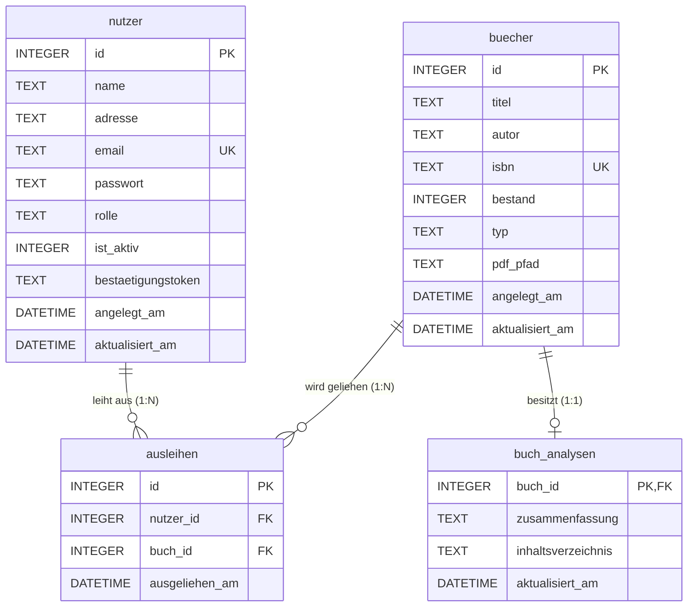
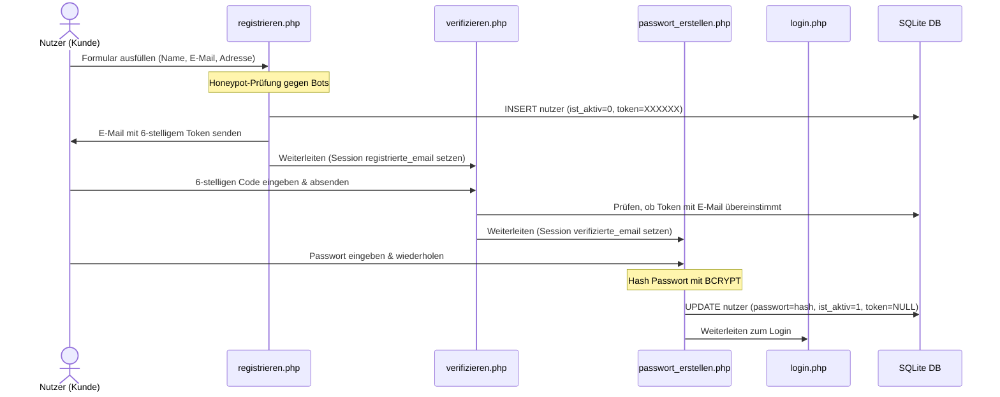
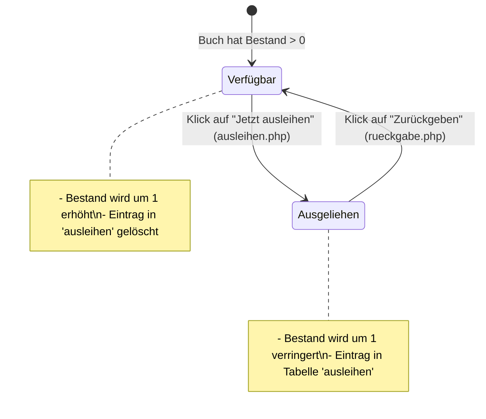

# Technische Projektdokumentation: Online-Bibliothek

Diese Dokumentation beschreibt die Funktionsweise, Architektur und das Zusammenspiel der einzelnen Komponenten der sicheren PHP-Webanwendung „Online-Bibliothek“. Sie dient als verständliche Übersicht für Entwickler und Dritte, um das System schnell zu verstehen.

---

## 1. Systemarchitektur & Verzeichnisstruktur

Die Anwendung basiert auf einer **Client-Server-Architektur** unter Verwendung von **PHP** für die serverseitige Logik, **HTML/CSS** für das User Interface (UI) und **SQLite3** als relationale eingebettete Datenbank. 

### Verzeichnisstruktur
- [db.php](file:///c:/xampp/htdocs/php_uebungen/bibliothek_03/db.php): Zentrales Skript für die Datenbankverbindung (PDO) und Tabellenerstellung.
- [setup.php](file:///c:/xampp/htdocs/php_uebungen/bibliothek_03/setup.php): Initialisiert oder setzt die Datenbank zurück und lädt Standard-Testdaten.
- [index.php](file:///c:/xampp/htdocs/php_uebungen/bibliothek_03/index.php): Die zentrale Startseite (Dashboard), die je nach Benutzerrolle unterschiedliche Ansichten rendert.
- [navbar.php](file:///c:/xampp/htdocs/php_uebungen/bibliothek_03/navbar.php): Die globale, oben eingebundene Navigationsleiste.
- **Authentifizierung / Registrierung**:
  - [registrieren.php](file:///c:/xampp/htdocs/php_uebungen/bibliothek_03/registrieren.php): Registrierungsprozess (Honeypot-Schutz & Token-Generierung).
  - [verifizieren.php](file:///c:/xampp/htdocs/php_uebungen/bibliothek_03/verifizieren.php): Eingabe des 6-stelligen per E-Mail erhaltenen Verifizierungstokens.
  - [passwort_erstellen.php](file:///c:/xampp/htdocs/php_uebungen/bibliothek_03/passwort_erstellen.php): Festlegen des finalen Passworts nach erfolgreicher Verifizierung.
  - [login.php](file:///c:/xampp/htdocs/php_uebungen/bibliothek_03/login.php): Login-Maske (inkl. Schutz vor Passwortmanagern & BCRYPT-Prüfung).
  - [logout.php](file:///c:/xampp/htdocs/php_uebungen/bibliothek_03/logout.php): Beendet die Sitzung sicher.
- **Medienverwaltung**:
  - [buch_uebersicht.php](file:///c:/xampp/htdocs/php_uebungen/bibliothek_03/buch_uebersicht.php): Auflistung aller Medien im System (nur für Mitarbeiter).
  - [buch_anlegen.php](file:///c:/xampp/htdocs/php_uebungen/bibliothek_03/buch_anlegen.php): Hinzufügen neuer physischer Bücher oder E-Books via PDF-Upload (inkl. KI-Parsing & Bulk-Import).
  - [buch_bearbeiten.php](file:///c:/xampp/htdocs/php_uebungen/bibliothek_03/buch_bearbeiten.php): Bearbeiten von Medien-Metadaten.
- **Kundenverwaltung**:
  - [kunde_anlegen.php](file:///c:/xampp/htdocs/php_uebungen/bibliothek_03/kunde_anlegen.php): Manuelle Registrierung eines neuen Kunden durch einen Mitarbeiter.
  - [kunde_bearbeiten.php](file:///c:/xampp/htdocs/php_uebungen/bibliothek_03/kunde_bearbeiten.php): Ändern von Kundendaten, Aktivieren oder Sperren von Accounts.
- **Ausleih- & Rückgabesystem**:
  - [ausleihen.php](file:///c:/xampp/htdocs/php_uebungen/bibliothek_03/ausleihen.php): Verarbeitet den Ausleihprozess (Bestands- & Statusprüfungen).
  - [rueckgabe.php](file:///c:/xampp/htdocs/php_uebungen/bibliothek_03/rueckgabe.php): Wickelt Rückgaben ab (erhöht den Buchbestand wieder).
- **Zusätzliche Ordner**:
  - `uploads/`: Verzeichnis für hochgeladene PDF-E-Books.
  - `vendor/`: Composer-Abhängigkeiten (z.B. der `Smalot\PdfParser` zum Extrahieren von PDF-Texten).

---

## 2. Datenbank-Design & Schema

Als Datenbank wird eine relationale **SQLite-Datenbank** (`bibliothek_02.sqlite`) verwendet. Die Verbindung wird über PDO (PHP Data Objects) in [db.php](file:///c:/xampp/htdocs/php_uebungen/bibliothek_03/db.php) aufgebaut.

### Datenbankschema (ER-Modell)



### Beschreibung der Tabellen

1. **`nutzer`**: 
   Speichert alle registrierten Personen. Die Spalte `rolle` steuert die Berechtigung (`user` für Bibliothekskunden, `mitarbeiter` für Bibliothekare/Admins). `ist_aktiv` blockiert gesperrte Konten oder Konten, die noch nicht verifiziert wurden.
2. **`buecher`**:
   Der Medienbestand. `typ` unterscheidet zwischen `physisch` (gedrucktes Buch) und `pdf` (digitales E-Book). `bestand` gibt die verfügbaren physischen Exemplare oder digitalen Lizenzen an.
3. **`ausleihen`**:
   Die Verknüpfungstabelle bildet eine klassische **M:N-Beziehung** zwischen `nutzer` und `buecher` ab. Sie speichert, welcher Nutzer welches Buch zu welchem Zeitpunkt ausgeliehen hat.
4. **`buch_analysen`**:
   Steht in einer **1:1-Beziehung** zu `buecher`. Hier werden von der KI (Ollama Gemma 3) generierte Zusammenfassungen und Inhaltsverzeichnisse gespeichert, die für die Suche und Buchempfehlungen (RAG) genutzt werden.

---

## 3. Zentrale Workflows & Zusammenspiel der Dateien

### A. Registrierungs- und Verifizierungsprozess (Self-Service)



1. **Einstieg**: Der Nutzer gibt auf [registrieren.php](file:///c:/xampp/htdocs/php_uebungen/bibliothek_03/registrieren.php) seine Daten ein.
2. **Token-Generierung & E-Mail**: Ein zufälliges 6-stelliges Token (`mt_rand`) wird generiert. Der Nutzer wird in der Tabelle `nutzer` angelegt – jedoch mit `ist_aktiv = 0` und leerem Passwort. Das Token wird per PHP-Funktion `mail()` an seine E-Mail geschickt.
3. **Verifizierung**: Auf [verifizieren.php](file:///c:/xampp/htdocs/php_uebungen/bibliothek_03/verifizieren.php) gleicht das System den eingebetteten Code ab. Stimmt er überein, wird die E-Mail temporär als verifiziert markiert.
4. **Passworterstellung & Aktivierung**: In [passwort_erstellen.php](file:///c:/xampp/htdocs/php_uebungen/bibliothek_03/passwort_erstellen.php) wird das Passwort eingegeben, mittels `password_hash()` verschlüsselt, `ist_aktiv = 1` gesetzt und das Token aus der DB gelöscht.

---

### B. Das Login- & Session-System

Wenn ein Benutzer versucht, sich anzumelden ([login.php](file:///c:/xampp/htdocs/php_uebungen/bibliothek_03/login.php)):
1. Es wird geprüft, ob die E-Mail existiert und das Passwort mittels `password_verify()` mit dem BCRYPT-Hash übereinstimmt.
2. Es wird geprüft, ob das Konto aktiv ist (`ist_aktiv == 1`).
3. Bei Erfolg werden die Session-Variablen `$_SESSION['nutzer_id']`, `$_SESSION['nutzer_name']` und `$_SESSION['rolle']` gesetzt.
4. Das Skript leitet auf [index.php](file:///c:/xampp/htdocs/php_uebungen/bibliothek_03/index.php) weiter.

Bei **jedem Seitenaufruf** der internen Seiten wird Folgendes überprüft:
```php
session_start();
if (!isset($_SESSION['nutzer_id'])) {
    header("Location: login.php");
    exit;
}
```
Zusätzlich sichert [logout.php](file:///c:/xampp/htdocs/php_uebungen/bibliothek_03/logout.php) die Abmeldung ab, indem die Session-Variablen geleert (`session_unset`), das Session-Cookie gelöscht und die Session komplett vernichtet wird (`session_destroy`).

---

### C. Ausleih- & Rückgabe-Prozess



- **Ausleihe ([ausleihen.php](file:///c:/xampp/htdocs/php_uebungen/bibliothek_03/ausleihen.php))**:
  1. Prüft, ob der Nutzer eingeloggt und nicht gesperrt ist.
  2. Startet eine SQL-Transaktion (`$db->beginTransaction()`).
  3. Prüft, ob das gewünschte Buch existiert und `bestand > 0` ist.
  4. Reduziert den `bestand` in der Tabelle `buecher` um 1.
  5. Fügt einen Datensatz in die Tabelle `ausleihen` ein (mit der aktuellen Systemzeit).
  6. Führt den `commit()` durch und leitet mit einer Erfolgsmeldung zurück.
  
- **Rückgabe ([rueckgabe.php](file:///c:/xampp/htdocs/php_uebungen/bibliothek_03/rueckgabe.php))**:
  1. Berechtigungs-Check: Nur Mitarbeiter oder der ausleihende Nutzer selbst dürfen eine Rückgabe anstoßen.
  2. Startet eine SQL-Transaktion.
  3. Erhöht den `bestand` in der Tabelle `buecher` um 1.
  4. Löscht den Datensatz in `ausleihen` anhand der Ausleih-ID.
  5. Commit und Rückleitung zur Hauptseite.

---

### D. Medien anlegen: Manueller Eintrag vs. PDF-Upload & Bulk-Import

Das Skript [buch_anlegen.php](file:///c:/xampp/htdocs/php_uebungen/bibliothek_03/buch_anlegen.php) ist eine der komplexesten Dateien. Es verarbeitet das Hinzufügen von Büchern über zwei verschiedene Pfade:

#### Pfad 1: Manueller Eintrag
1. Der Mitarbeiter füllt Titel, Autor und ISBN im Formular aus.
2. Das Skript sendet im Hintergrund einen HTTP-Request an die **Ollama API** (`gemma3:12b`), um eine kurze Inhaltsangabe und ein Inhaltsverzeichnis zu generieren.
3. Die Buchdaten werden in `buecher` gespeichert; die generierten Texte wandern in die 1:1-Tabelle `buch_analysen`.

#### Pfad 2: PDF-Upload (KI-gestütztes Parsing & Bulk-Import)
1. Der Mitarbeiter lädt ein PDF-Dokument (E-Book) hoch.
2. Die Datei wird in `uploads/` abgelegt.
3. Der Parser (`Smalot\PdfParser\Parser`) extrahiert den Text aus der PDF (bis zu 2500 Zeichen).
4. Dieser Text wird an die **Ollama API** geschickt. Der System-Prompt zwingt die KI, ausschließlich ein strukturiertes **JSON-Format** zurückzugeben:
   ```json
   {
     "entries": [
       { "type": "book", "title": "...", "author": "...", "isbn": "...", "summary": "...", "table_of_contents": "...", "format": "pdf", "stock": 0 },
       { "type": "user", "name": "...", "address": "...", "email": "..." }
     ]
   }
   ```
5. **Bulk-Import**: Das Skript parst diese JSON-Antwort. Enthält das PDF Informationen zu mehreren Büchern oder Kunden, werden alle extrahierten Einträge in einer **gemeinsamen Datenbank-Transaktion** angelegt!
   - Bei erkannten Nutzern wird standardmäßig ein aktiver Account (`ist_aktiv=1`) mit dem Default-Passwort `user123` angelegt.
   - Bei Büchern wird zudem die Tabelle `buch_analysen` automatisch befüllt.

---

## 4. RAG-KI-Bibliothekar (Interaktiver Chatbot)

Auf der [Startseite (index.php)](file:///c:/xampp/htdocs/php_uebungen/bibliothek_03/index.php) steht Kunden ein Chat-Feld zur Verfügung. Dieses implementiert ein einfaches **RAG (Retrieval-Augmented Generation)**-Verfahren:

1. **Kontext laden**: PHP liest den kompletten aktuellen Buchbestand sowie sämtliche hinterlegten KI-Zusammenfassungen und Inhaltsverzeichnisse aus der Datenbank.
2. **System-Prompt bauen**: Aus diesen Daten wird eine Liste formatiert und in den System-Prompt der KI eingebettet:
   > *"Du bist ein hilfsbereiter KI-Bibliothekar. Beantworte Fragen basierend auf dem folgenden Buchbestand: [Buchliste mit Zusammenfassungen]..."*
3. **API-Anfrage**: Die Frage des Nutzers wird zusammen mit diesem dynamisch generierten Prompt an das lokale/gehostete Modell `gemma3:12b` via HTTP POST übertragen.
4. **Antwortausgabe**: Die strukturierte Empfehlung des KI-Bibliothekars wird empfangen und für den Nutzer formatiert auf dem Dashboard ausgegeben.

---

## 5. Implementierte Sicherheitskonzepte

Die Anwendung wurde unter Berücksichtigung von OWASP-Richtlinien für Webanwendungssicherheit entwickelt:

1. **SQL-Injection-Schutz**: 
   Sämtliche SQL-Abfragen werden konsequent über **PDO Prepared Statements** (z. B. `$db->prepare()`) und Parameter-Binding ausgeführt. Keine Benutzereingaben werden direkt in SQL-Befehle hineinverkettet.
2. **XSS (Cross-Site Scripting)-Schutz**:
   Sämtliche Werte, die von Benutzern stammen (z. B. E-Mail, Name, Buch-Titel) oder von der Ollama KI generiert wurden, werden vor der Ausgabe in HTML-Seiten durch `htmlspecialchars()` maskiert.
3. **Session- & Cache-Schutz**:
   In [db.php](file:///c:/xampp/htdocs/php_uebungen/bibliothek_03/db.php) und [logout.php](file:///c:/xampp/htdocs/php_uebungen/bibliothek_03/logout.php) werden Cache-Control-Header gesetzt (`no-store, no-cache, must-revalidate`). Dies verhindert, dass der Browser vertrauliche Seiten nach dem Logout über die "Zurück"-Schaltfläche aus dem Cache anzeigt.
4. **Sicheres Passwort-Management**:
   Passwörter werden niemals im Klartext gespeichert. Die Speicherung erfolgt via `password_hash($passwort, PASSWORD_BCRYPT)`. Der Abgleich erfolgt über die zeitkonstante und sichere PHP-Funktion `password_verify()`.
5. **Spam- und Bot-Schutz (Honeypot)**:
   Registrierungs- und Login-Formulare enthalten ein verstecktes Eingabefeld (`username_hp`), welches für menschliche Nutzer unsichtbar ist. Füllen automatisierte Spam-Bots dieses Feld aus, bricht die Verarbeitung sofort ab.
