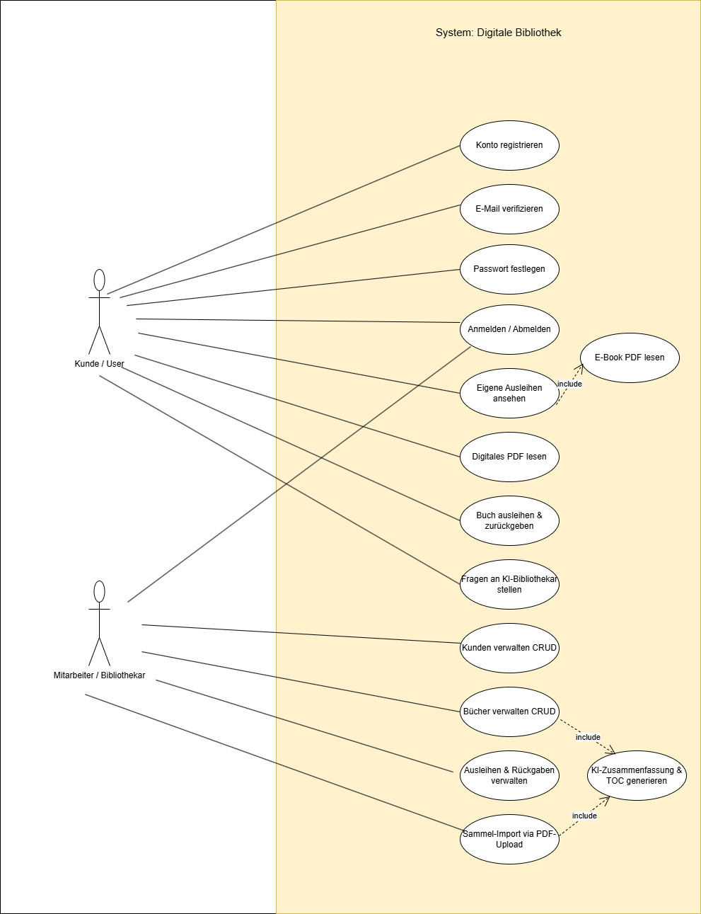
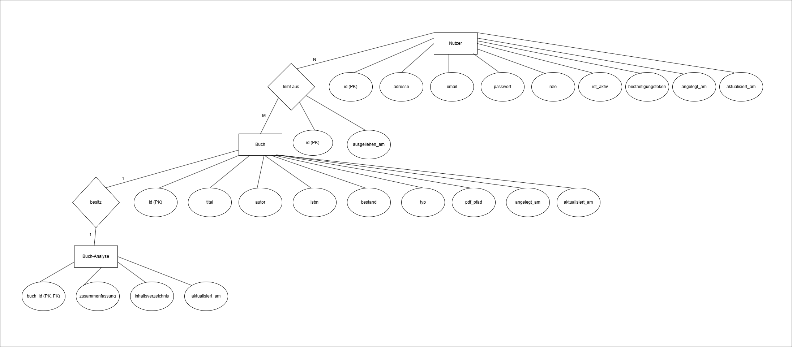

# Fallstudie: Digitale Bibliotheksverwaltung mit RAG-KI-Suche

**Live-Demo / Test-URL:** [https://jljuarez.de/bibliothek/login](https://jljuarez.de/bibliothek/login) *(Blueprint-Anbindung über Flask-Portfolio auf Strato)*

Dieses Projekt ist eine sichere PHP-Webanwendung zur Verwaltung von Bibliothekskunden, Buchbeständen und Ausleihen. Die Anwendung wurde für eine PHP-Fallstudie entwickelt und enthält einen sicheren Registrierungs-Workflow mit Verifizierungstokens sowie einen RAG-basierten (Retrieval-Augmented Generation) KI-Bibliothekar.

---

## 1. Projektbeschreibung & Funktionsumfang

Die Anwendung bietet zwei Hauptrollen mit differenzierten Zugriffsrechten:

### Rolle `mitarbeiter` (Bibliothekar / Admin)

- **Kundenverwaltung (CRUD):** Kunden registrieren, deren Kontaktdaten und Aktivitätsstatus (`ist_aktiv`) bearbeiten, Accounts sperren oder löschen.
- **Medienverwaltung (CRUD):** Bücher und E-Books (PDFs) anlegen, bearbeiten und löschen.
  - **KI-gestützte PDF-Analyse:** Beim Hochladen einer PDF liest der Parser den Text aus und erfasst mithilfe der Ollama-KI (`gemma4:31b`) die Buchdaten (Titel, Autor, ISBN) und generiert Zusammenfassungen und Inhaltsverzeichnisse. Die Formularfelder sind beim PDF-Upload optional.
  - **Sammel-Import:** Enthält eine PDF mehrere Bücher oder Benutzerinformationen, erkennt der Parser dies und legt automatisch alle erkannten Einträge in einem einzigen Durchlauf in der Datenbank an.
- **Ausleih- & Rückgabeübersicht:** Einsicht in alle aktiven Ausleihen im System, manuelle Buchungen vornehmen und Rückgaben abwickeln.

### Rolle `user` (Bibliothekskunde)

- **Registrierungs-Workflow:** Sicheres Registrieren per Name und E-Mail.
- **Verifikations-System:** E-Mail-Verifizierung über ein generiertes 6-stelliges Token und anschließendes Festlegen eines individuellen Passworts.
- **Medien leihen:** Eigenständiges Ausleihen physischer Bücher (abhängig vom Bestand) oder digitaler E-Books (abhängig von der Anzahl an verfügbaren Lizenzen).
- **Digitale Bibliothek:** PDFs direkt im Browser öffnen und lesen.
- **KI-Bibliothekar:** Interaktiver Chatbot (`gemma4:31b`), der Buchempfehlungen auf Basis des Buchbestands sowie der hinterlegten Zusammenfassungen gibt (RAG). Das System nutzt Token-Optimierung (`max_tokens: 500`), Kontext-Kompression, ein smartes Antwort-Caching sowie einen Graceful-Degradation-Fallback für maximale Zuverlässigkeit.

---

## 2. Use-Case-Diagramm (Anwendungsfälle)

Das Use-Case-Diagramm visualisiert die Interaktionen der beiden Akteure (`Kunde` und `Mitarbeiter`) mit den Kernfunktionen des Systems:

### Beschreibung der Use Cases:

- **Kunde / User:** Kann sich registrieren, seine E-Mail verifizieren und ein Passwort festlegen. Nach dem Login kann er eigene Ausleihen einsehen, E-Books lesen, Bücher ausleihen/zurückgeben und den KI-Bibliothekar befragen.
- **Mitarbeiter / Bibliothekar:** Kann sich ebenfalls anmelden, hat jedoch exklusiven Zugriff auf die Systemverwaltung (CRUD-Operationen für Kunden und Bücher sowie die globale Verwaltung aller Ausleihen). Zudem kann er hochgeladene PDFs (E-Books) automatisch auslesen lassen, wobei die extrahierten Buch- und Nutzerdaten per Sammel-Import automatisch im System angelegt und verteilt werden.

---

## 3. Datenbank-Struktur & ER-Diagramm (Chen-Notation)

Die Anwendung nutzt eine relationale **SQLite3-Datenbank** (`bibliothek_02.sqlite`) mit vier Tabellen.

Das folgende ER-Diagramm wurde in der klassischen **Chen-Notation** erstellt:

- **Rechtecke:** Entitäten (Entity Sets)
- **Rauten:** Beziehungen (Relationship Sets) mit Kardinalitäten (1:1, 1:N, M:N)
- **Ellipsen:** Attribute (Primärschlüssel sind <u>unterstrichen</u>)

### Tabellenbeschreibung:

1.  **`nutzer`**: Speichert Kundendaten, Rollen, Aktivierungsstatus und Verifizierungstokens.
2.  **`buecher`**: Speichert Metadaten zu physischen Büchern und E-Books (inkl. PDF-Dateipfaden und Beständen).
3.  **`ausleihen`**: Verknüpfungstabelle für aktive Ausleihen. Bildet die **M:N-Beziehung** zwischen `nutzer` und `buecher` ab und besitzt die Attribute `id` (PK) und `ausgeliehen_am`.
4.  **`buch_analysen`**: Bildet eine **1:1-Beziehung** zu `buecher` ab. Speichert die von der KI generierten Zusammenfassungen und Inhaltsverzeichnisse für E-Books (werden beim PDF-Import automatisch befüllt).

---

## 4. Sicherheitskonzepte (SQL-Injection- & XSS-Schutz)

Das Projekt erfüllt höchste Sicherheitsstandards für Webanwendungen:

- **Schutz vor SQL-Injection:** Alle SQL-Interaktionen (Datenbank-Abfragen, Logins, CRUD-Operationen) werden konsequent über **Prepared Statements** (PDO `$stmt->prepare()`) realisiert. Variablen werden niemals direkt in SQL-Strings verkettet.
- **Schutz vor Cross-Site Scripting (XSS):** Sämtliche Benutzereingaben sowie KI-Antworten, die im HTML-Kontext ausgegeben werden, werden mit `htmlspecialchars()` maskiert.
- **Sicheres Passwort-Management:** Passwörter werden mittels `password_hash($passwort, PASSWORD_BCRYPT)` verschlüsselt in der Datenbank abgelegt. Der Login-Abgleich erfolgt über `password_verify()`.
- **Session- & Cache-Schutz:** Beim Logout wird die Session komplett gelöscht (`session_destroy()`) und globale Cache-Control-Header gesetzt (`no-store, no-cache`). Dies verhindert, dass unbefugte Dritte nach dem Abmelden über den Browser-Zurück-Button vertrauliche Daten sehen können.

---

## 5. Installations- und Startanleitung

### Systemanforderungen

- **PHP:** Version 8.0 oder höher (mit aktivierter PDO-SQLite-Erweiterung).
- **Webserver:** Apache (z. B. über XAMPP oder direkt auf Strato).
- **Ollama (für die KI-Anbindung):** Eine laufende API (lokal oder gehostet via API-Gateway) mit dem Modell `gemma4:31b`.

### Installationsschritte

1.  **Dateien kopieren:** Kopiere alle Projektdateien in das Root-Verzeichnis deines Webservers (z. B. unter `C:\xampp\htdocs\bibliothek_03\` oder auf deinen Strato-Webspace).
    - _Hinweis:_ Die Anwendung verwendet einen integrierten Autoloader (`vendor/autoload.php`) für den PDF-Parser, sodass keine separate Dependency-Installation per Composer notwendig ist.
2.  **Datenbank einrichten (Setup):** Rufe die Datei `setup.php` im Browser auf:
    - _Lokal:_ `http://localhost/bibliothek_03/setup.php`
    - _Online:_ `https://deine-domain.de/setup.php`
    - _Dieser Schritt erstellt die SQLite-Datenbankdatei (`bibliothek_02.sqlite`) neu, legt alle Tabellen an und befüllt das System mit sauberen Demodaten._
3.  **Anwendung starten:** Rufe die Login-Seite im Browser auf (z. B. `http://localhost/bibliothek_03/login.php`).

### Test-Zugangsdaten (nach Setup)

- **Mitarbeiter (Admin):** `admin@bib.de` / Passwort: `admin123`
- **Normaler Kunde:** `jan@va.de` / Passwort: `user123`
